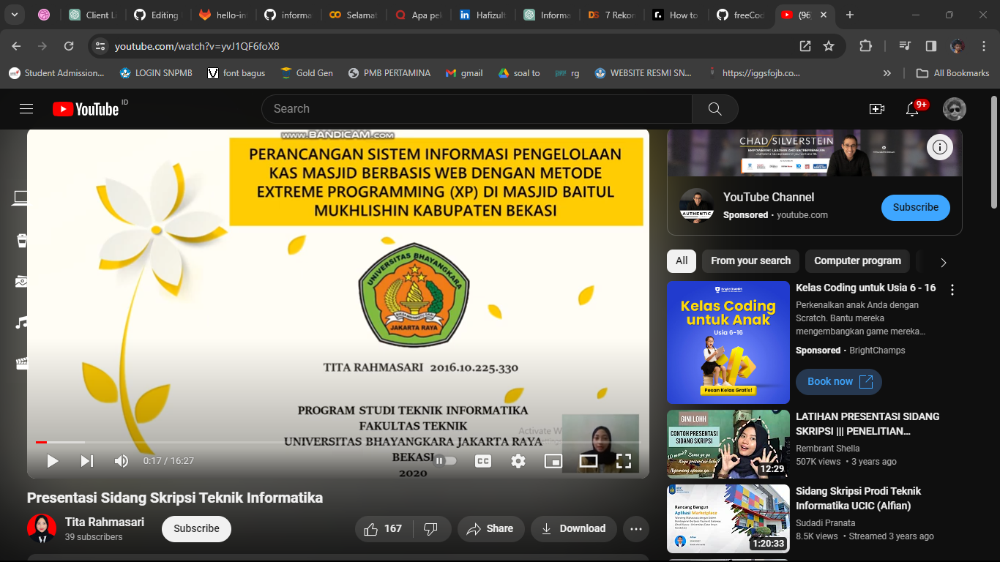
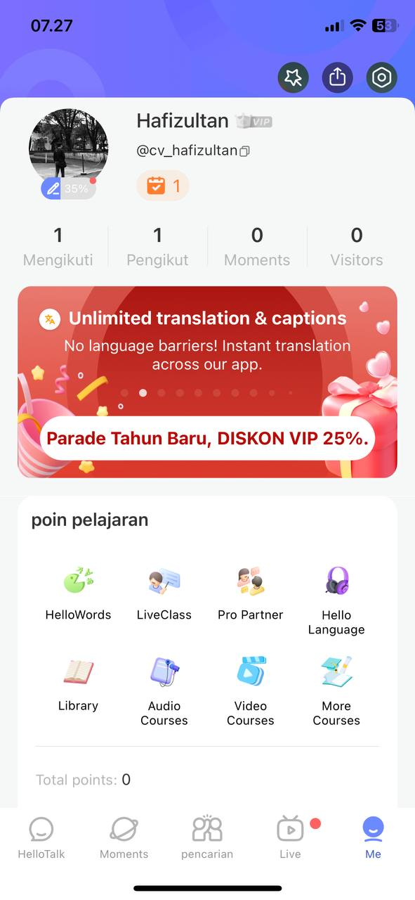

# UAS-PengenalanInformatika
UAS mata kuliah Pengenalan Informatika kelas B

## Menjelaskan dan Menginternalisasi Computational Thinking ⭐⭐⭐⭐⭐⭐⭐
Definisi Computational Thinking:
Computational thinking adalah  cara berpikir yang sistematis dan logis yang menggunakan konsep-konsep yang mendasari pemrograman komputer untuk memecahkan masalah. Ini bukan hanya tentang menulis kode, ini tentang mengatur dan merancang solusi masalah secara efektif dan efisien.

Elemen-elemen Computational Thinking:
1. Pemecahan Masalah (Problem Solving):
Computational Thinking adalah tentang kemampuan untuk memecah masalah besar menjadi masalah lebih kecil yang dapat diselesaikan.
Ini seperti memecahkan teka-teki menjadi potongan-potongan kecil agar lebih mudah dipecahkan.
2. Pengorganisasian Data (Data Organization):
Penting untuk memahami bagaimana data dapat diatur dan diproses untuk mencapai solusi yang diinginkan.
Ini termasuk memahami struktur data dan bagaimana data  disimpan dan diakses.
3. Representasi Algoritma (Algorithmic Representation):
Penting untuk dapat mengungkapkan langkah-langkah penyelesaian suatu masalah secara logis.
Hal ini sering kali melibatkan pemahaman  algoritma, yang merupakan serangkaian langkah yang diperlukan untuk menyelesaikan suatu tugas.
4. Abstraksi (Abstraction):
Kompleksitas dapat disederhanakan dengan mengabaikan detail yang tidak perlu dan hanya berfokus pada informasi penting.  Abstraksi memungkinkan Anda melihat gambaran besarnya tanpa tersesat dalam terlalu banyak detail.

Menginternalisasi Computational Thinking:
Untuk benar-benar menginternalisasi pemikiran komputasi, Anda perlu mempraktikkannya dalam situasi kehidupan nyata. Ini termasuk memecahkan masalah dunia nyata, mengembangkan algoritma, dan mengimplementasikan kode. Berikut beberapa langkah untuk membantu Anda menginternalisasikan konsep ini.
1. Latihan Pemecahan Masalah:
Ambil beberapa masalah kecil dan selesaikan dengan menggunakan pendekatan berpikir komputasi. Identifikasi langkah-langkah yang Anda ambil untuk menyelesaikan setiap masalah.
2. Proyek Kecil:
Mulailah dengan proyek kecil yang melibatkan pemrosesan data atau penulisan program sederhana.
Berlatih organisasi data, representasi algoritmik, dan abstraksi.
3. Bergabunglah dengan komunitas pemrograman:
Bergabunglah dengan forum atau komunitas online untuk mendiskusikan masalah pemrograman dan berbagi solusi Anda dengan orang lain. Ini  membantu orang memahami cara lain untuk menggunakan pemikiran komputasi.
4. Mengikuti Pelatihan dan Workshop:
Menghadiri kursus pelatihan dan lokakarya yang berfokus pada pengembangan pemikiran komputasi. Ini akan memberi Anda pengalaman praktis dan bimbingan dari para ahli.

## Menjelaskan Jenis-Jenis Mesin Komputasi ⭐⭐⭐

## Mengktifkan dan Mencoba Google Colab [v] ⭐⭐⭐⭐⭐
Saya telah mengaktifkan dan mencoba Google Colab. Saya mencobanya ketika praktek menggunakan Text to Speech yang dijelaskan ketika berada didalam kelas.
<!DOCTYPE html>
<html lang="en">

<head>
    <meta charset="UTF-8">
    <meta name="viewport" content="width=device-width, initial-scale=1.0">
    <meta http-equiv="X-UA-Compatible" content="ie=edge">
</head>

<body>
    
</body>

</html>

## Mencoba Console Sistem Operasi

### Windows CMD [v] ⭐⭐⭐⭐

Referensi [1](https://www.stationx.net/windows-command-line-cheat-sheet/)

### Linux Terminal Menggunakan Google Colab [v] ⭐⭐⭐⭐

## Membuat Algoritma Dalam Bentuk Flow Chart [v] ⭐⭐⭐⭐⭐
Saya telah membuat sebuah algoritma berupa flow chart untuk Pemesanan Makanan Online menggunakan https://online.visual-paradigm.com/id/diagrams/features/flowchart-tool/
<!DOCTYPE html>
<html lang="en">

<head>
    <meta charset="UTF-8">
    <meta name="viewport" content="width=device-width, initial-scale=1.0">
    <meta http-equiv="X-UA-Compatible" content="ie=edge">
</head>

<body>
    
</body>

</html>

## Mencoba Scratch Bahasa Indonesia [v] ⭐⭐⭐⭐⭐⭐⭐

Referensi [1](https://scratch.mit.edu/)

## Mencoba Algoritma Bubble Sort Menggunakan Java [v] ⭐⭐⭐

## Mencoba dan Mendemonstrasikan Penggunakan IDE ⭐⭐

## Mendaftar, Mengeksplorasi, dan Mendemonstrasikan Penggunaan HackerRank [v] ⭐⭐⭐⭐⭐

## Mendemonstrasikan Pembuatan Aplikasi / Game Pada Platform : Mobile / Desktop / Web Browser ⭐⭐⭐⭐⭐

## Mencoba Instalasi Database (PostgreSQL / MySQL / dsb.) [v] ⭐⭐⭐

Referensi installer [PostgreSQL](https://www.postgresql.org/download/windows/)
Referensi tambahan [1](https://db-engines.com/en/ranking)

## Mencoba Eksplorasi dan Query Database Menggunakan Database Explorer (Dbeaver / dsb.) [v] ⭐⭐⭐

Referensi installer [Dbeaver](https://dbeaver.io/download/)
Referensi [1](https://www.w3schools.com/postgresql/postgresql_create_table.php)

## Mendemonstrasikan dan Menjelaskan Penggunaan Web Browser untuk Mengakses Halaman Website HTML [v] ⭐⭐⭐⭐
- Dokumen HyperText Markup Language (HTML) ada untuk memudahkan pertukaran informasi berbasis Hypertext.
- Web Browser seperti Firefox, Chrome, Opera, ada untuk membuka dan mempresentasikan dokumen HTML
- Dokumen HTML ini bisa bersumber dari web server yang kita ingin datanya (Tokopedia, Wikipedia, Detik.com, dsb.) atau bisa juga dukumen HTML yang kita buat sendiri

## Mendemonstrasikan dan Menjelaskan Komponen Dari Contoh Uniform Resource Locator (URL) [v] ⭐⭐

Referensi: [1](https://www.startertutorials.com/ajwt/uniform-resource-locator.html)

## Mencoba Pelacakan Informasi Server dari Alamat Domain [v] ⭐

Referensi terkait: [1](https://en.wikipedia.org/wiki/Country_code_top-level_domain) [2](https://en.wikipedia.org/wiki/List_of_Internet_top-level_domains)

## Mencoba Pembuatan Halaman Web Menggunakan HTML, CSS, dan JavaScript [v] ⭐⭐⭐

Referensi tutorial 
- Isi konten halaman web : [HTML](https://www.w3schools.com/html/)
- Styling halaman web : [CSS](https://www.w3schools.com/css/)
- Interaktivitas halaman web : [JavaScript](https://www.w3schools.com/js/)

## Mencoba Penerapan Teknik Search Engine Optimization (SEO) Pada HTML [v] ⭐⭐⭐

Referensi []

## Mencoba Pembuatan File JSON [v] ⭐⭐⭐

## Mencoba Penggunaan Web Hosting Dengan Untuk Halaman HTML [v] ⭐⭐⭐

## Mencoba Penggunaan Web Hosting Dengan Untuk Web Service [v] ⭐⭐⭐

## Mencoba HTTP Request dan Web API dengan Hoppscotch / Postman [v] ⭐⭐

## Mendemonstrasikan Penggunaan Developer Tools Pada Web Browser (Firefox / Chrome) [v] ⭐⭐⭐⭐⭐

## Mengeksplorasi dan Menjelaskan Layanan Cloud Service yang Diminati (GCP / AWS / Azure) [v] ⭐⭐
Saat ini banyak perusahaan berbasis digital seperti Gojek, Tokopedia, Instagram, Telkom memanfaatkan Cloud Service karena memudahkan untuk mulai pembangunan dan analisis menggunakan infrastruktur digital yang dapat berkembang secara dinamis dengan tarif yang sangat teliti.

Referensi cloud service: [Amazon Web Service](https://aws.amazon.com/) [Microsoft Azure](https://azure.microsoft.com) [Google Cloud Platform](https://cloud.google.com) 

## Mencoba Penggunaan Content Management System (Wordpress) [v] ⭐⭐⭐

## Mendemonstrasikan Akses Konten Multimedia (Image, Audio, Video) ⭐⭐⭐

## Mencoba Edit Konten Multimedia (Image, Audio, Video) [v] ⭐⭐

## Mencoba Pembuatan Game dan Simulasi Menggunakan Logo [v] ⭐⭐

## Mencoba Pemrosesan Konten Multimedia (Image, Audio) Menggunakan Google Colab [v] ⭐⭐⭐

## Mencoba Web Tool AI Discriminative (Image Classification) [v] ⭐⭐⭐⭐

## Mencoba Web Tool AI Generative (Text to Image, Text to Text) [v] ⭐⭐⭐⭐

## Mencoba Model Machine Learning Menggunakan Google Colab, TTS, Speechrecognition, dan HuggingFace [v] ⭐⭐⭐

## Mencoba Data Visualization Dengan Tools [v] ⭐⭐

## Mencoba Data Visualization Dengan Code [v] ⭐⭐

## Mendaftar dan Mencoba Eksplorasi HuggingFace [v] ⭐⭐⭐

## Mendaftar dan Mencoba Eksplorasi Kaggle [v] ⭐⭐⭐⭐

## Mencoba Protokol Komunikasi IoT (MQTT) [v] ⭐

## Mencoba Memproses File CSV Menggunakan Google Colab [v] ⭐⭐

## Mencoba Memproses File Big Data ORC Menggunakan Google Colab [v] ⭐⭐

## Menjelaskan Jurnal, Conference, Artikel, Grade Jurnal [v] ⭐⭐⭐⭐⭐

## Eksplorasi Artikel Jurnal / Conference di Repository Terekognisi Internasional (IEEE / Arxiv / Science Direct / ACM /DBLP) [v] ⭐⭐⭐⭐

## Menonton Video Presentasi Tugas Akhir Informatika ⭐⭐⭐⭐⭐
Saya menonton sidang skripsi mahasiswi teknik informatika Universitas Bhayangkara Jakarta Raya dengan judul skripsi "Perancangan Sistem Informasi Pengelolaan Kas Masjid Berbasis Web Dengan Algoritma Naive Bayes dan Metode Extreme Programming (Xp) Di Masjid Baitul Mukhlishin Kabupaten Bekasi" yang saya akses melalui YouTube.
<!DOCTYPE html>
<html lang="en">

<head>
    <meta charset="UTF-8">
    <meta name="viewport" content="width=device-width, initial-scale=1.0">
    <meta http-equiv="X-UA-Compatible" content="ie=edge">
</head>

<body>
    
</body>

</html>

## Mengeksplorasi Seluruh Profesi Terkait Informatika dan Profesi yang Diminati ⭐⭐⭐⭐
Saya telah mengeksplorasi profesi di dunia Informatika melalui web Quora :
https://qr.ae/pKJTOC

Dan menurut saya, profesi yang mungkin sesuai dengan diri saya adalah UX/UI Designer. Karena saya tertarik ke dunia visual.

## Eksplorasi Tools Untuk Belajar Bahasa Inggris (Duolingo) ⭐⭐⭐

## Eksplorasi Tools Untuk Belajar Berbicara Bahasa Inggris (HelloTalk) ⭐⭐⭐ 
Saya telah mencoba aktivasi tools HelloTalk di HP saya. Di aplikasi tersebut kita bisa chat ke orang lain yang mau bantu kita belajar bahasa yang diinginkan (saya memilih bahasa Inggris). Bisa kirim pesan teks, suara, gambar, terus mereka juga membantu menkoreksi kalau ada kesalahan. Ada fitur grup juga untuk berdiskusi.
<!DOCTYPE html>
<html lang="en">

<head>
    <meta charset="UTF-8">
    <meta name="viewport" content="width=device-width, initial-scale=1.0">
    <meta http-equiv="X-UA-Compatible" content="ie=edge">
</head>

<body>
    
</body>

</html>

## Eksplorasi Lowongan Pekerjaan IT ⭐⭐⭐

## Eksplorasi Lowongan Freelancer IT (Upwork / Toptal / Freelancer.com) ⭐⭐⭐

## Eksplorasi dan Pilih Topik yang Diminati di Roadmap.sh ⭐⭐⭐
Saya telah mengeksplorasi web tersebut dan menurut saya topik design system merupakan topik yang sangat menarik. Dan saya memang menyukai hal-hal yang ber aspek designing.

https://roadmap.sh/design-system

## Eksplorasi Top Github Project yang Diminati ⭐⭐ 
Saya telah mengeksplorasi Top Github Project. Dan saya merasa top 1 daftar tersebut yaitu freeCodeCamp memiliki alasan yang kuat sehingga berada pada peringkat 1. Bagaimana tujuan dan manfaat dari freeCodeCamp itu sendiri yang sangat bermanfaat bagi banyak orang. seperti yang saya baca bahwasanya freeCodeCamp menyediakan akses terbuka ke materi-materi pembelajaran dan proyek-proyek praktis yang dapat membantu orang membangun keterampilan mereka di bidang pemrograman dan pengembangan perangkat lunak.

## Membangun Profil Linkedin dan Mengikuti Akun-Akun Inspirasif Bertema Informatika ⭐⭐⭐
Saya telah membangun profile Linkedin saya dan mengikuti beberapa akun inspiratif
www.linkedin.com/in/hafanza

## Membangun Profil Github Page ⭐⭐⭐⭐⭐
Saya telah melakukan perintah untuk membangun profle github yang mana saya gunakan sekarang untuk menjawab pertanyaan UAS mata kuliah Pengenalan Informatika ini.

## Mengikuti Workshop / Event / Course Terkait IT ⭐⭐⭐⭐
Saya tergabung dalam komunitas Google Developer Student Clubs (GDSC) UIN SGD Bandung sebagai anggota. Walaupun belakangan ini saya belum secara mengikuti acaran-acara yang diselenggarakan GDSC. Namun, kedepannya saya akan selalu berusaha mengikuti kegiatannya secara aktif.

## Membaca dan Mengambil Inspirasi Dari Buku Bertema Informatika ⭐⭐⭐⭐⭐
Saya telah menemukan e-book yang sesuai yang saya akses melalui https://www.academia.edu/39170410/Buku_Ajar_Komputer_Cerdas_untuk_Mahasiswa_Teknik_Informatika
Namun, saya belum membacanya. Saya akan membacanya dan mengambil inspirasi dari buku tersebut

